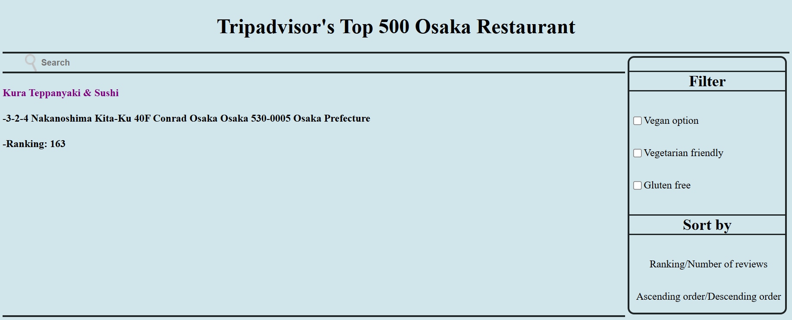

# [Website] Search through Tripadvisor's Top 500 Osaka Restaurants

#### About Osaka-HTML-Python

+ Based on my old project "Project Osaka," which aimed to make a program that could process tabularized raw data similar to the pivot table from Microsoft Excel.
+ Made an interactive website that could search and filter Osaka's Top 500 restaurants.
+ The original project was based on C++; however, I recreated the program with Python, HTML, and CSS. 
+ Started the project on 19APR24.

#### Development Environment

+ Python
+ HTML
+ CSS

#### Features

+ Filter Options—vegan, vegetarian friendly, gluten free.
+ Sort Data by raw ranking or number of reviews.
+ Displays restaurant's name, address, and ranking/number of reviews after searching.

#### How to Use

  

1) This is the main page of the website.

  

2) Click ranking or number of reviews and the order to sort the results. Type in the keyword that you would like to search.

  

3) The website shows the filtered results (restaurants' names, addresses, and rankings/number of reviews) in a designated order. 

  

4) You can also use the "vegan, vegetarian friendly, and gluten free" filter.

  

5) The result after searching sushi restaurants with the vegan filter on.

  

6) Restaurants' number of reviews is shown when sorted by the number of reviews. / Restaurants' rankings are shown when sorted by rankings.

#### Reference

+ Project Osaka: https://github.com/alexseungminhan/Find-Osaka-Restuarant
+ Raw data file: https://www.kaggle.com/datasets/kanchana1990/osakas-top-500-dining-spots-tripadvisor
